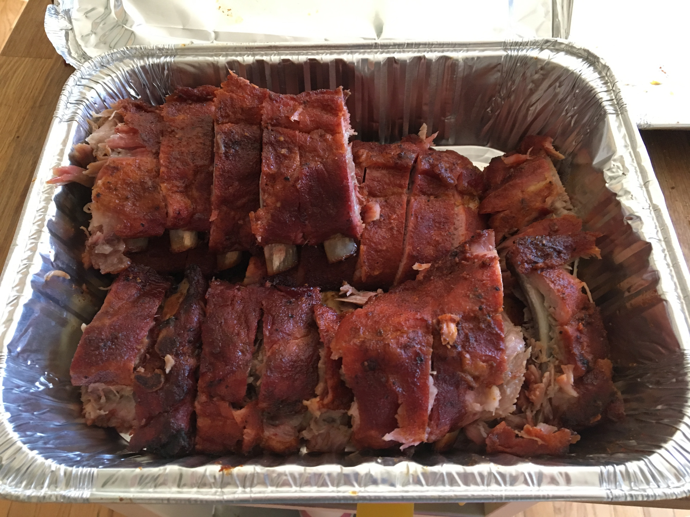

This particular smoke was inspired by Meathead's [Last meal Ribs](https://amazingribs.com/best-barbecue-ribs-recipe). Meathead's content is fantastic and highly recommended. Take a look at his [book](https://www.amazon.com/Meathead-Science-Great-Barbecue-Grilling/dp/054401846X/ref=sr_1_1?ie=UTF8&qid=1550508980&sr=8-1&keywords=meathead+the+science+of+great+barbecue+and+grilling) as well. The ribs were dry-brined, rubbed, smoked, cut, and devoured.

## The ribs

This paricular cut of ribs was purchased from Sam's Club. They're labeled "Pork Baby Back Ribs" and come in a vacuum sealed pack with three full slabs. This day they ran at $2.88/lb and at 8.45lb they rang in at $24.34. As soon as I brought them home from the store, I removed the membrane from the back to encourage tenderness. In this cook, I smoked two of the slabs and saved one for another day.

## Seasoning the ribs

The night before this particular smoke, I salted the ribs using plain Morton's Table Salt. The amount was unscientific - I sprinked them with roughly the amount I would use if I was salting any other food I was about to eat. They went back into the fridge to allow the salt to absorb overnight.

The next day just prior to throwing them on the smoker, I dry rubbed them with a generous amount of home made [Memphis Dust](https://amazingribs.com/tested-recipes/spice-rubs-and-pastes/meatheads-memphis-dust-rub-recipe), a dry rub that calls for lots of paprika and sugars.

## The smoke

The ribs went on the smoker at 10:30am. The tool for the job was the <a href="https://www.amazon.com/gp/product/B06XKK552M/ref=ppx_yo_dt_b_asin_title_o05__o00_s02?ie=UTF8&psc=1" target="_blank">Traeger Lil Texas Elite 22</a> loaded with <a href="https://www.amazon.com/Traeger-PEL313-Barbecue-Pellets-20-Pound/dp/B0015X54J8/ref=sr_1_19?crid=3MZEO99RPW2RM&keywords=traeger+pellets&qid=1550512325&s=lawn-garden&sprefix=traeger%2Clawngarden%2C145&sr=1-19" target="_blank">apple pellets</a>. The temperature was set at 225 degrees for two hours. After two hours, the ribs were wrapped tightly in heavy duty aluminum foil to help raise the internal temperature faster. They were pulled off the smoker at 2pm.

## Prep

On the thick wooden cutting board, the ribs were sliced with a sharp knife between the bones and stored in a foil tub. Sweet Baby Ray's sauce was served on the side. These ribs are so flavorful, I ate them without the sauce!