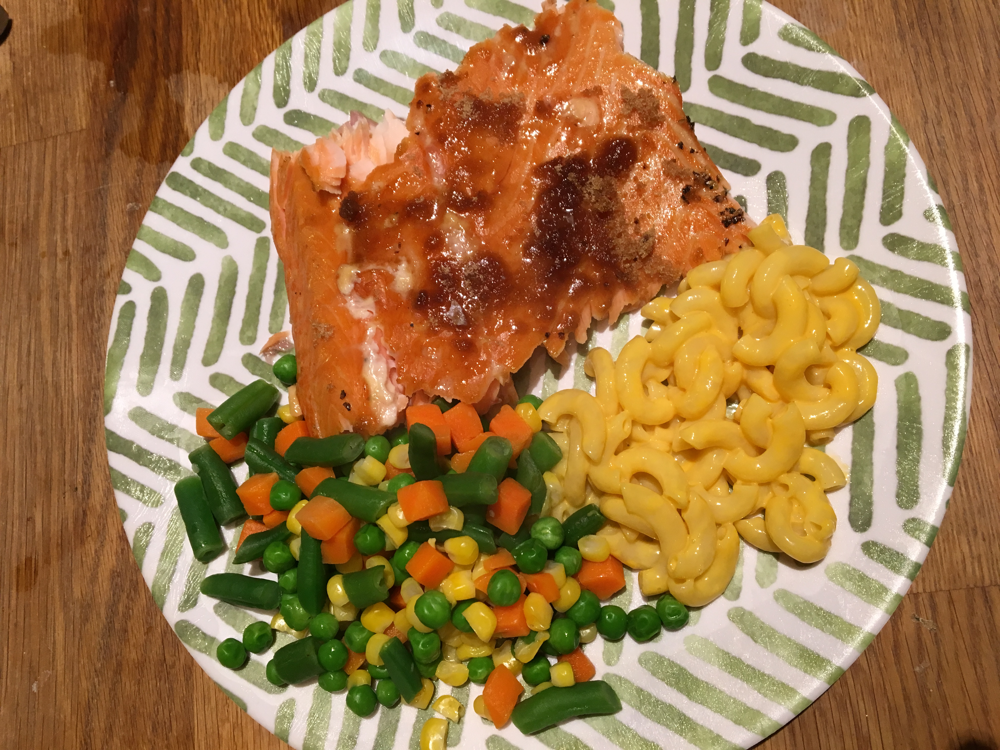

<!--  -->

December 29th, smoked salmon was on the menu. In amateur distracted dad fashion, I skipped an important step prepping this salmon for cooking, but it still turned out marvelous. This cook followed Meathead's [Fancy Schmancy Salmon recipe](https://amazingribs.com/tested-recipes/seafood-recipes/schmancy-hot-smoked-salmon-recipe). In addition to the AmazingRibs.com content, take a look at his [book](https://www.amazon.com/Meathead-Science-Great-Barbecue-Grilling/dp/054401846X/ref=sr_1_1?ie=UTF8&qid=1550508980&sr=8-1&keywords=meathead+the+science+of+great+barbecue+and+grilling) as well. 

## The Salmon

This cook was an Atlantic Salmon Filet from Aldi. The filet weighed in at 2.58lb and at $7.69/lb cost $19.84. Like most salmon available to buy these days, it is sold with the skin still attached, which is no problem at all.

## The Marinade

I mixed 1/2 gallon of warm water, 1/2lb of salt, about 2 tablespoons of garlic powder, about 2 tablespoons of coursely ground black paper, and 1/4 cup of white sugar described in more detail by Meathead <a href="https://amazingribs.com/tested-recipes/seafood-recipes/schmancy-hot-smoked-salmon-recipe" target="_blank">here</a>. I added the entire salmon filet to the mixture, skin included and soaked for three hours.

## The Smoke

The salmon was placed on a piece of brown paper bag cut to size. This keeps the filet from sticking to the grill, and also allows for easy removal of the skin after the cook is done. The grill was set to 225 degrees. 90 minutes later the filet had browned slightly and became flaky when touched with a fork. At this point I added a generous sprinkling of brown sugar, and then let the salmon cook for another fifteen minutes. I'd recommend doing this prior to putting them on the grill initially.

## Cut and Serve

Lastly, I removed the paper bag liner and the skin came right along with it. I sliced up the salmon and served it alongside mixed veggies and mac 'n cheese. Surprisingly, my 15 month old loved it! She ate every bite.

<!--  -->