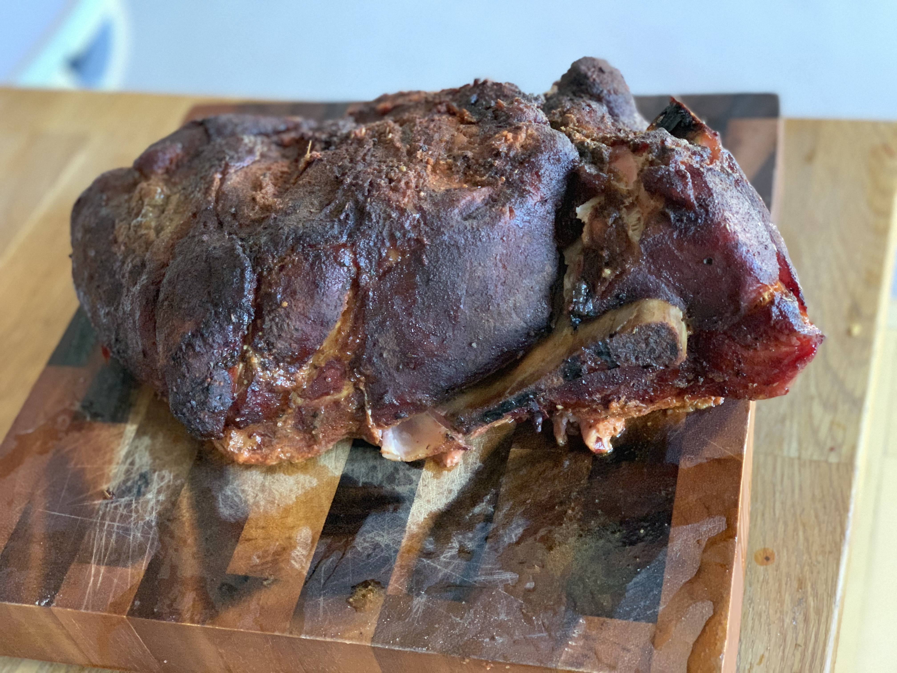
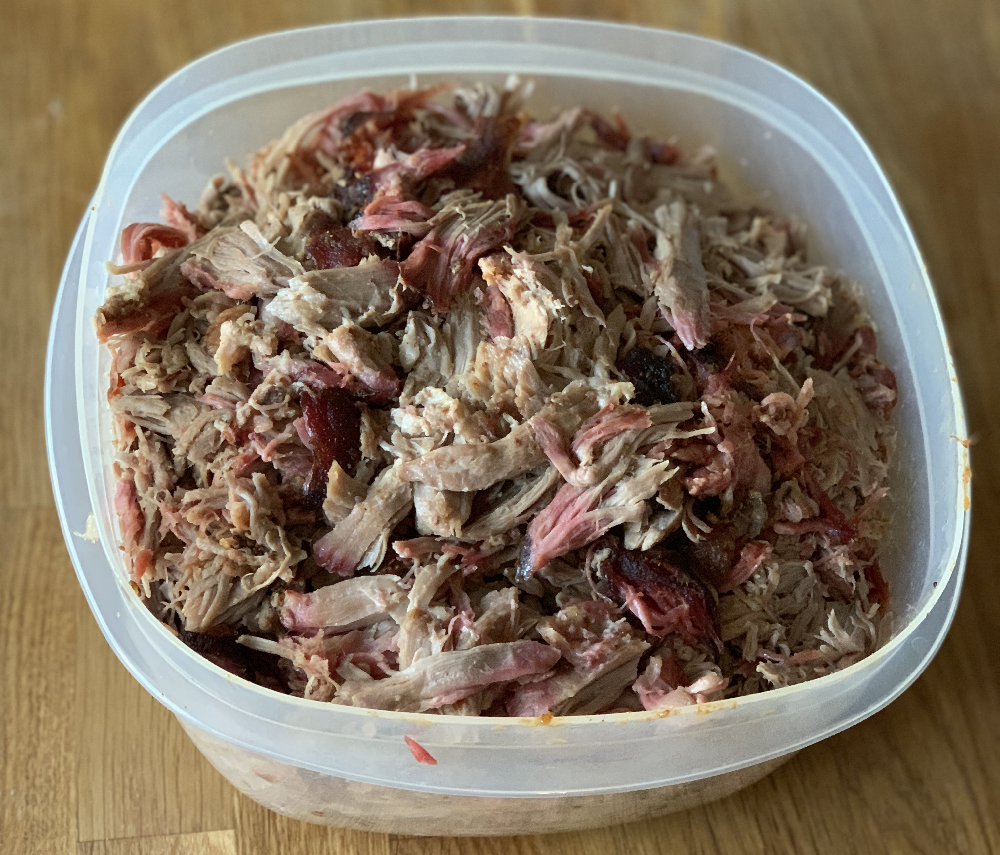

This particular smoke was inspired by AmazingRibs.com's <a href="https://amazingribs.com/tested-recipes/pork-recipes/perfect-pulled-pork-recipe" target="_blank">Best Pulled Pork BBQ Recipe Ever</a>. Meathead’s content is fantastic and highly recommended. Take a look at his <a href="https://www.amazon.com/Meathead-Science-Great-Barbecue-Grilling-ebook/dp/B01FX1AUNC" target="_blank">book</a> as well. 

## The Meat

This cut was a 9.63lb bone-in pork shoulder/butt from Sam's Club. At $1.78/lb the entire cut came in at $17.14. After removing from the package, I trimmed off some of the excess fat where possible, and started the seasoning.

## Prepping the Pork

The afternoon prior to the cook, I coated the pork butt with a liberal coating of salt and then followed it up with a thick coating of <a href="https://amazingribs.com/tested-recipes/spice-rubs-and-pastes/meatheads-memphis-dust-rub-recipe" target="_blank">Meathead's Memphis Dust</a>. I let the meat sit fully rubbed overnight so it could absorb the salt.

## The Cook

The pork went on the <a href="https://www.amazon.com/gp/product/B06XKK552M/ref=ppx_yo_dt_b_asin_title_o05__o00_s02?ie=UTF8&psc=1" target="_blank">Traeger Lil Texas Elite 22</a> loaded with <a href="https://www.amazon.com/Traeger-PEL318-All-Natural-Hardwood-Pellets/dp/B01F6ME4F8" target="_blank">apple pellets</a> at 6am. The temperature was set at 225 degrees. It stayed on the grill for six hours before reaching an internal temperature of 150 degrees. At that point, I started the Texas Crutch, which is really just a fancy term for wrapping the meat in foil. This prevents the meat from stalling at that temperature for a freakishly long amount of time.

The pork reached an internal temperature of 203 degrees at 4:05pm, at which point it was promptly removed from the smoker.

Some folks let the meat rest. We hit the end temp right at hangry toddler dinner time, so there was no opportunity for resting meat on this day. I pulled the bone and it slid right out and shredded the pork with my handy set of <a href="https://www.amazon.com/Shredding-Handling-Resistant-Perfect-Barbeque/dp/B00UIR2JU4" target="_blank">wolf claws</a>. Shredding the pork took about 20 minutes, and it was ready to serve. This particular cook was a tremendous hit with the toddler.

