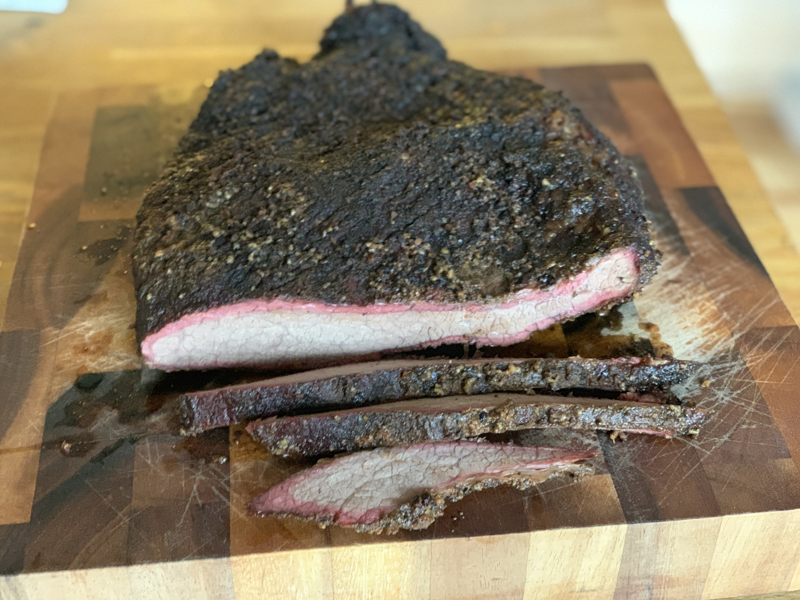
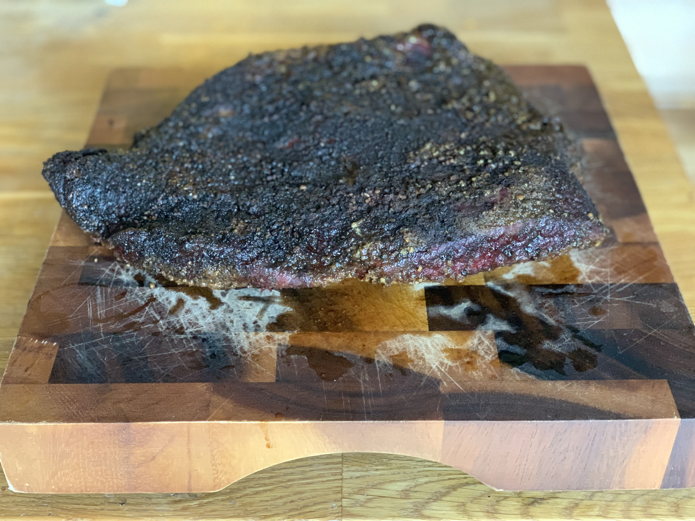
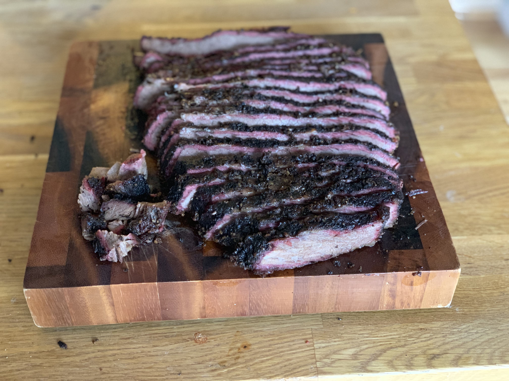

Brisket is widely regarded as the most challenging meat to smoke. I chose Meathead's <a href="https://amazingribs.com/tested-recipes/beef-and-bison-recipes/smoked-brisket-texas-style" target="_blank">Smoked Beef Brisket</a> article from AmazingRibs as my starting point. I'd recommend his <a href="https://www.amazon.com/Meathead-Science-Great-Barbecue-Grilling-ebook/dp/B01FX1AUNC" target="_blank">book</a> as well, it's essentially my grilling bible.

## The Meat

This Flat Whole USDA Choice Angus Beef Brisket weighted in at 5.38 pounds and at $5.58/lb rang up at $30.02 from Sam's Club. 

## Preparing the Brisket

Th night before the cook prep work began. I trimmed excess fat, then injected the brisket with standard no-frills beef broth, pulling the needle out of the cut as I injected. Largely this is to add moisture and salt to the brisket. I then sprinked the brisket with salt and rubbed it with Meathead's <a href="https://amazingribs.com/tested-recipes/spice-rubs-and-pastes/big-bad-beef-rub-recipe" target="_blank">Big Bad Beef Rub</a>. If you're cooking for young'ens or folks sensitive to spiciness, I'd recommend holding off on the cayanne pepper in this recipe.

## The Cook

I put the brisket on the <a href="https://www.amazon.com/gp/product/B06XKK552M/ref=ppx_yo_dt_b_asin_title_o05__o00_s02?ie=UTF8&psc=1" target="_blank">Traeger Lil Texas Elite 22</a> loaded with loaded with <a href="https://www.amazon.com/Traeger-PEL318-All-Natural-Hardwood-Pellets/dp/B01F6ME4F8" target="_blank">apple pellets</a> at midnight and promptly went to bed. I woke up at 7am and the temperature was already at 168 degrees. At that point I used a technique known as the Texas Crutch, which is essentially just removing the meat, tightly wrapping it in heavy duty foil, and returning it to the grill. This prevents the meat from stalling at 160 or so degrees for an excessive amount of time. The meat reached 203 degrees at 9am that morning and was removed from the grill, for a total cook time of 9 hours. The brisket was placed in a cooler still wrapped in foil and allowed to rest for 90 minutes. At that point the internal temperature had dropped to 150 degrees.

## Serving

After the brisket had rested, it was sliced perpendicular to the grain into thin slices. I cut the "burnt ends" into cubes. Those were scavanged off of the cutting board and didn't make it to lunch. This was a fantastic brisket! Delicious!

